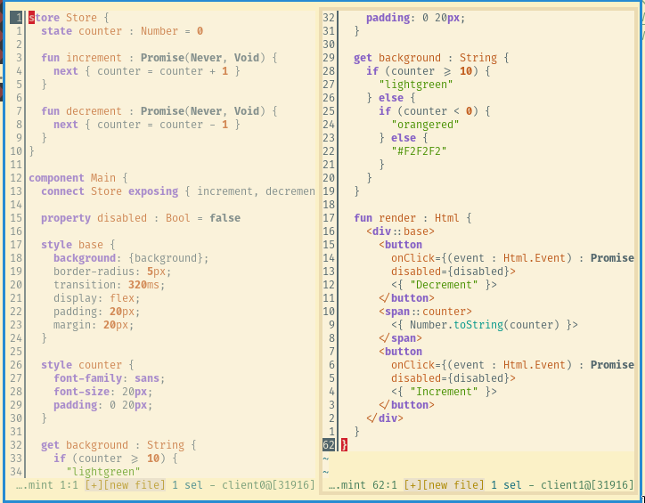

# Kakoune Mint support

Plugin for [Kakoune][kakoune] text editor adding support for [Mint
language][mint]



## Features

- syntax highlighting
- basic code completion
- `mint-generate-procfile` command for use with Procfile managers like [Hivemind][hivemind]

Code completion is pretty basic, Mint has LSP implementation in the [roadmap](https://www.mint-lang.com/roadmap)
so there is no point in writing anything more advanced here.

## Installation

Source `mint.kak` from your `kakrc` or use [plug.kak]:

```
plug "https://github.com/TeddyDD/kakoune-mint"
```

[mint]: https://www.mint-lang.com/
[Kakoune]: http://kakoune.org/
[hivemind]: https://github.com/DarthSim/hivemind
[plug.kak]: https://github.com/andreyorst/plug.kak

## Changelog

- 0.1 2018-10-02:
    - initial release
    - Kakoune v2018.09.04
    - Mint 0.3.0
- 0.2 2019-03-15:
    - Kakoune v2019.01.20
    - Mint 0.4.0
    - __CHANGE__ new directory layout (breaking: update path in `kakrc`)
    - _ADD_ new keywords
- 0.3 2019-07-04:
    - Kakoune v2019.07.01
    - __CHANGE__ use modules
    - _ADD_ comment blocks
    - _FIX_ replace `in` keyword with `of` (for loops)
    - _ADD_ missing `when` keyword (for loop)

